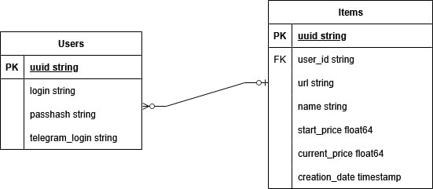
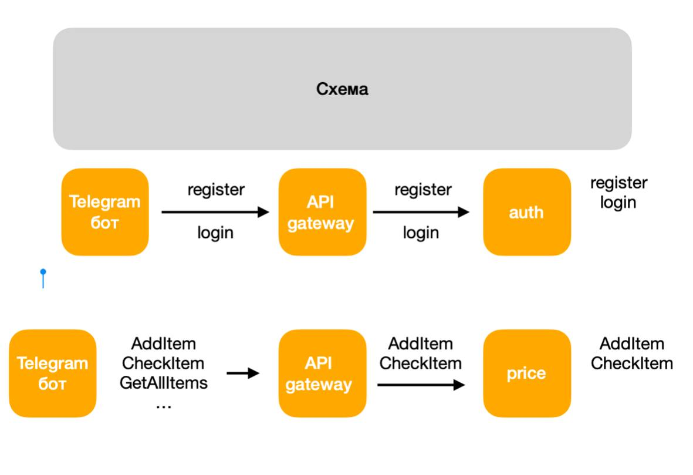

# Price Monitoring Telegram Bot

## Описание проекта

Этот проект — микросервисное приложение, предоставляющее функциональность Telegram-бота для отслеживания цен на товары по ссылке. Архитектура разделена на 4 микросервиса и использует API Gateway и Nginx для маршрутизации.

---

## Архитектура

Проект состоит из следующих компонентов:

- TelegramBot — взаимодействие с пользователем через Telegram.
- API Gateway — промежуточный слой между TelegramBot и сервисной частью, маршрутизирует запросы.
- Auth Service — микросервис авторизации, отвечает за регистрацию, логин и логаут.
- Price Monitor Service — микросервис для отслеживания цен по ссылке.

Маршрутизация осуществляется через Nginx, настроенный в API Gateway. TelegramBot взаимодействует с API Gateway по одному открытому порту.

## Схемы баз данных

Postgres

Redis

---

## Основные эндпоинты

### 1. /register
Описание: Регистрация пользователя    
Параметры:  
- telegram_id 
- login  
- password

---

### 2. /login
Описание: Авторизация пользователя    
Параметры:  
- telegram_id  
- login  
- password

---

### 3. /logout
Описание: Удаление авторизованной сессии 
Параметры:  
- telegram_id  
- login  
- password

---

### 4. /check-item
Описание: Добавление ссылки на товар для отслеживания    
Параметры:  
- url  
- login  

Ответ:  
- Название товара  
- Начальная цена    
- Текущая цена  
- Разница в цене

---

### 5. /get-all-items
Описание: Получение всех отслеживаемых товаров по логину   
Параметры:  
- login  

Ответ: список всех товаров пользователя

---

## Технологии

- Golang 
- Docker
- Nginx
- PostgreSQL
- Redis